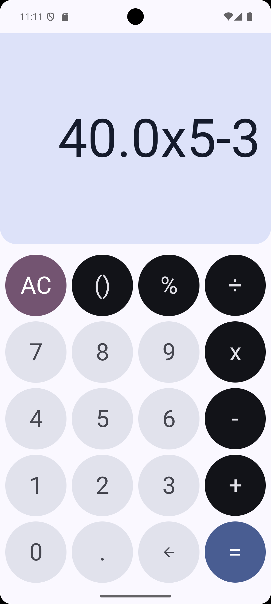
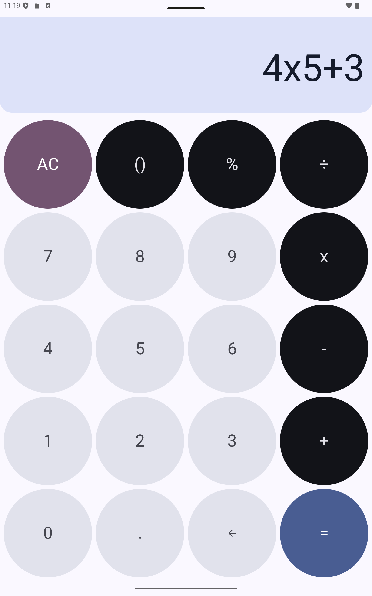

# Material Calculator

A simple calculator app built with Jetpack Compose and Material Design.

## Features

* Basic arithmetic operations: addition, subtraction, multiplication, and division.
* Clean and intuitive user interface following Material Design guidelines.
* Responsive layout for different screen sizes.

## Screenshots

## Architecture

The app follows a simple MVI-like architecture with two main layers:

* **Domain**: Contains the business logic for parsing and evaluating mathematical expressions. This layer is independent of the Android framework.
* **Presentation**: Contains the UI components built with Jetpack Compose. The UI observes the state from the domain layer and displays it to the user.

## Built with

* [Kotlin](https://kotlinlang.org/)
* [Jetpack Compose](https://developer.android.com/jetpack/compose)
* [Material Design](https://material.io/)